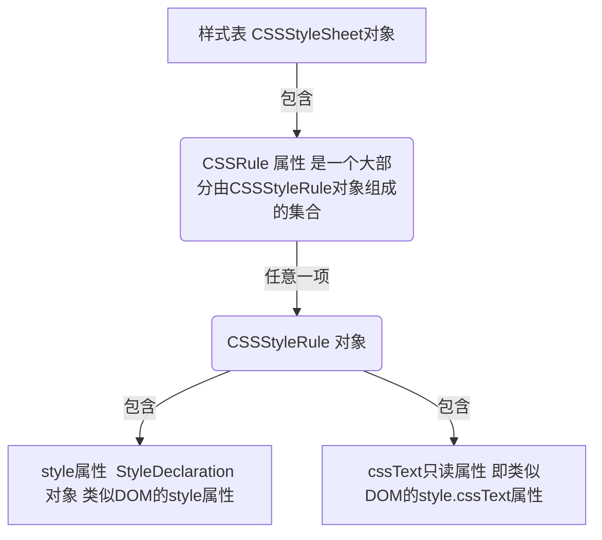

# 乾坤大挪移第一层《样式》

#### 多行文本超出变省略号

```
overflow: hidden;     
text-overflow: ellipsis;     
display: -webkit-box;     
-webkit-line-clamp: 3;     
-webkit-box-orient: vertical;
```

#### 用 css 实现文字被选中时，背景和字体颜色都发生改变：

```
::selection { background: pink; color: #fff; }
::-moz-selection { background:pink;color: #fff; }
::-webkit-selection { background:pink; color: #fff; 
```

##### HTML 元素的 style 特性

任何支持 `style` 特性的 `HTML` 元素在 `JavaScript` 中都有一个对应的 `style` 属性。这个 `style` 对象是 `CSSStyleDeclaration` 的实例，包含着通过 `HTML` 的 `style` 特性指定的所有样式信息，但不包含与外部样式表或嵌入样式表经层叠而来的样式。在 `style` 特性中指定的任何 `CSS` 属性都将表现为这个`style` 对象的相应属性。对于使用短划线（分隔不同的词汇，例如 `background-image` ）的 `CSS` 属性名，必须将其转换成驼峰大小写形式，才能通过 `JavaScript` 来访问。

```
var myDiv = document.getElementById("myDiv");
//设置背景颜色
myDiv.style.backgroundColor = "red";
//改变大小
myDiv.style.width = "100px";
myDiv.style.height = "200px";
//指定边框
myDiv.style.border = "1px solid black";
```

通过 `style` 对象同样可以取得在 `style` 特性中指定的样式。以下面的 `HTML` 代码为例。

```
<div id="myDiv" style="background-color:blue; width:10px; height:25px"></div>
```

在 `style` 特性中指定的样式信息可以通过下列代码取得。

```
alert(myDiv.style.backgroundColor); //"blue"
alert(myDiv.style.width); //"10px"
alert(myDiv.style.height); //"25px"
```

##### 计算的样式

虽然 `style` 对象能够提供支持 `style` 特性的任何元素的样式信息，但它不包含那些从其他样式表层叠而来并影响到当前元素的样式信息。“DOM2 级样式”增强了 `document.defaultView` ，提供了`getComputedStyle()` 方法。这个方法接受两个参数：**要取得计算样式的元素**和一个**伪元素字符串**（例如 "`:after`" ）。如果不需要伪元素信息，第二个参数可以是 `null` 。 `getComputedStyle()` 方法返回一个 `CSSStyleDeclaration` 对象（与 `style` 属性的类型相同），其中包含当前元素的所有计算的样式。

```
<!DOCTYPE html>
<html>
<head>
    <title>Computed Styles Example</title>
    <style type="text/css">
        #myDiv {
            background-color: blue;
            width: 100px;
            height: 200px;
        }
    </style>
</head>
<body>
    <div id="myDiv" style="background-color: red; border: 1px solid black"></div>
</body>
</html>

var myDiv = document.getElementById("myDiv");
var computedStyle = document.defaultView.getComputedStyle(myDiv, null);
alert(computedStyle.backgroundColor); // "red"
alert(computedStyle.width); // "100px"
alert(computedStyle.height); // "200px"
alert(computedStyle.border); // 在某些浏览器中是"1px solid black"
```

pis：`dom`元素上的`style` 属性，也是 `CSSStyleDeclaration` 对象

##### 操作样式表

`CSSStyleSheet` 类型表示的是样式表，包括通过 `<link>`元素包含的样式表和在 `<style>` 元素中定义的样式表，两种获取样式表。
第一种：`document.styleSheets` 获取的是页面所有的样式表集合（ `StyleSheetList`）
第二种：通过`dom`元素（ `link` 、`style` ）的 `sheet` 属性获得

样式表属性如下：

- `disabled`：表示样式表是否被禁用的布尔值。这个属性是可读/写的，将这个值设置为`true`可以禁用样式表。
- `href`：如果样式表是通过 `<link>`包含的，则是样式表的 `URL`；否则，是 `null`

`document.styleSheets`，获取文档上的所有样式表集合。通过这个集合的 `length`属性可以获知文档中样式表的数量，而通过方括号语法或 `item()`法可以访问每一个样式表

```
// 第一种：获取样式表（ CSSStyleSheet 对象）
const sheet1 = document.styleSheets[0];
sheet1.disabled = true; // 禁用第一个样式表

// 第二种：获取样式表（ CSSStyleSheet 对象）
const sheet2 = document.querySelector( 'link' ).sheet;
```

**样式表 和 dom 属性的关系**



**给样式表新增样式 insertRule()**  
可以使用 `insertRule()` 方法向样式表中添加新规则。这个方法接收两个参数：**规则的文本**和表示**插入位置的索引值**。

```
const sheet = document.styleSheets[0];
sheet.insertRule("body { background-color: silver }", 0); // 使用 DOM 方法

```

**从样式表中删除样式 deleteRule()**
支持从样式表中删除规则的 DOM 方法是 `deleteRule()` ，它接收一个参数：要删除规则的**索引**。

```
// 要删除样式表中的第一条规则
const sheet = document.styleSheets[0];
sheet.deleteRule(0);
```

#### 最佳实践

**1. 可读性**

- 变量名应为名词如 `car` 或 `person`。
- 函数名应该以动词开始，如 `getName()`。返回布尔类型值的函数一般以 `is` 开头，`isEnable()`。
- 变量和函数都应使用合乎逻辑的名字，不要担心长度。

**2、可维护**

- 常量与代码逻辑分离

```
// 分离前
if(true) {
    alert('成功！')
}else {
    alert('失败！')
}

// 分离后 （推荐）
const Constants = {
    SUCCESS: '成功',
    FAIL: ‘失败！’
}
if(true) {
    alert(Constants.SUCCESS)
}else {
    alert(Constants.FAIL)
}
```

**3、性能**

- 避免全局查找

  可能优化脚本性能最重要的就是注意全局查找。使用全局变量和函数肯定要比局部的开销更大，因为要涉及作用域链上的查找。请看以下函数：

  ```
  function updateUI(){
      var imgs = document.getElementsByTagName("img");
      for (var i=0, len=imgs.length; i < len; i++){
          imgs[i].title = document.title + " image " + i;
      }
      var msg = document.getElementById("msg");
      msg.innerHTML = "Update complete.";
  }
  ```

  该函数可能看上去完全正常，但是它包含了三个对于全局 `document` 对象的引用。如果在页面上有多个图片，那么`for` 循环中的 `document` 引用就会被执行多次甚至上百次，每次都会要进行作用域链查找。通过创建一个指向 `document` 对象的局部变量，就可以通过限制一次全局查找来改进这个函数的性能：

  ```
  function updateUI(){
      var doc = document;
      var imgs = doc.getElementsByTagName("img");
      for (var i=0, len=imgs.length; i < len; i++){
          imgs[i].title = doc.title + " image " + i;
      }
      var msg = doc.getElementById("msg");
      msg.innerHTML = "Update complete.";
  }
  ```

- 避免不必要的属性查找
  ```
  var query = window.location.href.substring(window.location.href.indexOf("?"))
  ```
  在这段代码中，有 6 次属性查找：`window.location.href.substring()`有 3 次，`window. location.href.indexOf()`又有 3 次。只要数一数代码中的点的数量，就可以确定属性查找的次数了。
  推荐写法：
  ```
  var url = window.location.href;
  var query = url.substring(url.indexOf("?"));
  ```
  这个版本的代码只有 4 次属性查找，相对于原始版本节省了 33%。在更大的脚本中进行这种优化，倾向于获得更多改进。

* 推荐写法

  ```
  //《 案例1 》
  var name = values[i];
  i++;
  // 推荐改成
  var name = values[i++]

  //《 案例2 》
  var a = 1;
  var b = 2;
  // 推荐改成
  var a = 1, b = 2;
  ```

#### 拖拽上传文件

```
<--html-->
<div class="container">拖拽上传图片</div>

// js
const container = document.querySelector(".container");
container.addEventListener("dragenter", e => {
        e.preventDefault();
});
 container.addEventListener("dragover", e => {
        e.preventDefault();
});
container.addEventListener("drop", e => {
        e.preventDefault();
        const files = e.dataTransfer.files;  // 获取文件对象列表
        toAjax(files);
});
function toAjax(files) {
        const form = new FormData();
        for (let i = 0; i < files.length; i++) {
            form.append(`img${i}`, files[i]);
        }
        const xhr = new XMLHttpRequest();
        xhr.open("post", "http:xxx.com/upload");
        xhr.onreadystatechange = function() {
            if (xhr.readyState == 4) {
                alert(xhr.responseText);
            }
        };
        xhr.send(form);
}
```

#### window.performance 对页面的性能信息的记录
